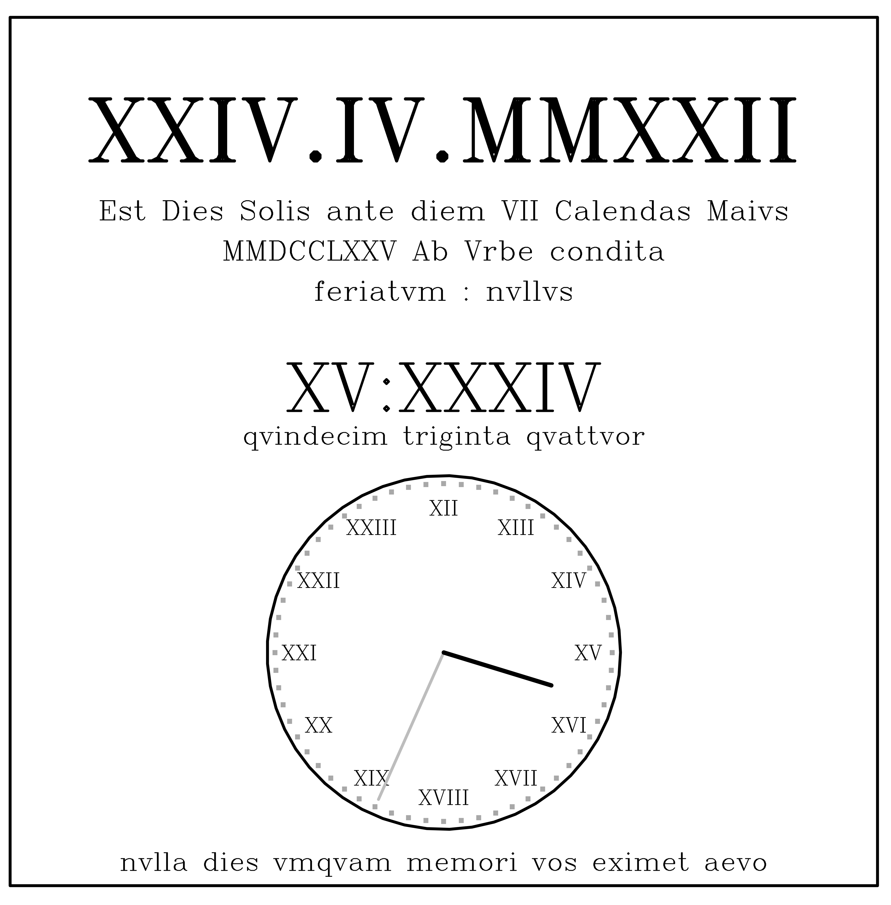

# Roman numeral date, calendar, and clock

R code to produce a simple date and clock plot in Roman numerals & Latin text (Gregorian) and Latin (Roman calendar). Works on a 24-hour system. Clock plot based on a modified version of <code>caroline::<a href="https://search.r-project.org/CRAN/refmans/caroline/html/plotClock.html">plotClock</a></code>.

## Set-up
1. Install the following libraries in R:
- <code><a href="https://cran.r-project.org/web/packages/caroline/index.html">caroline</a></code>
- <code><a href="https://lubridate.tidyverse.org/">lubridate</a></code>
- <code><a href="https://cran.r-project.org/web/packages/rstudioapi/index.html">rstudioapi</a></code>

You can do this easily with the following command:
> <code>install.packages(c("caroline", "lubridate", "rstudioapi"))</code>

2. Download the Roman festivals (<em>feriae</em>) dataset (<code>feriae.RData</code>) and Latin number names dataset (<code>RomNumNam.RData</code>) into the source directory (i.e., the directory in which the script <code>RomanDateClock.R</code> lives).

3. Run the script <code>RomanDateClock.R</code> in R, then you're ready to plot a real-time date and clock in Roman numerals & Latin. 

- Note that there is no zero in Roman numerals (the Romans had no need for it, apparently). I've therefore just incuded '00' when the hour or minute = zero in the 24-hour clock.
- I have provided the time in Latin text as well below the Roman numeral time display: e.g., the time 15:49 is spelt out as <em>qvindecim vndeqvinqvaginta</em>; note that when the hour = 00, I have replaced <em>nihil</em> ('nothing') with <em>media nocte</em> ('midnight')
- Top date is the Gregorian date in Roman numeral format (DD.MM.YYYY).
- Also provided is the Roman calendar date in in Latin. Briefly, the date format follows these rules:
    - there are seven days in the week as in the modern week (but in Latin — <em>Dies Lvnae</em>, <em>Dies Martis</em>, <em>Dies Mercvris</em>, <em>Dies Iovis</em>, <em>Dies Veneris</em>, <em>Dies Satvrni</em>, <em>Dies Solis</em>)
    - months are the same as modern months (but in Latin — <em>Ianvarivs</em>, <em>Febrvarivs</em>, <em>Martivs</em>, <em>Aprilis</em>, <em>Maivs</em>, <em>Ivnivs</em>, <em>Ivlivs</em>, <em>Avgvstvs</em>, <em>September</em>, <em>October</em>, <em>November</em>, <em>December</em>)
    - the 1st of every month is a <a href="https://www.wordsense.eu/calends/"><strong><em>Kalends</em></strong></a>
    - the 13th (Jan, Feb, Apr, Jun, Aug, Sep, Nov, Dec) or the 15th (Mar, May, Jul, Oct) are the <a href="https://www.wordsense.eu/ides/"><strong><em>Ides</em></strong></a>
    - the <a href="https://www.wordsense.eu/nones/"><strong><em>Nones</em></strong></a> are 8 days prior to the <strong><em>Ides</em></strong>
    - All other days work backward from the next 'special day' (i.e., <em>Kalends</em>, <em>Nones</em>, or <em>Ides</em>), + 1 to account for the day itself
    - if the date falls on the day before a special day, it receives the precursor <strong><em>Pridie</em></strong> ('the day before') before the name of the relevant special day
    - the reference year is the <a href="https://historycooperative.org/the-founding-of-rome-birth-of-an-empire/">founding of Rome</a> as a city (753 BC)
    - if the day happens to be be a <a href="https://en.wikipedia.org/wiki/Roman_festivals">Roman festival</a> day (<em>feriatum</em>; those Romans partied a lot), then the relevant <em>feriatum</em> will be indicated; if it is not a festival day, the <em>feriatvm</em> will return <em>nvllvs</em> (none).

Some examples of the Roman calendar in Latin:
- '<em>Est Dies Mercvris ante diem XI Calendas Maivs MMDCCLXXV Ab Vrbe condita ... feriatvm : Parilia</em>' means 'It is Wednesday the eleventh day before the Kalends of May, 2775 years after the founding (of Rome) ... holiday: Festival in honour of Pales, the tutelary divinity of shepherds' (i.e., 20 April 2022)
- '<em>Est Dies Satvrni ante diem VII Calendas Ianvarivs MMDCCLII Ab Vrbe condita ... feriatvm : Dies Natalis Solis Invicti</em>' means 'It is Saturday the seventh day before the Kalends of January, 2752 years after the founding (of Rome) ... holiday: Birth of the Invincible Sun' (i.e., 25 December 1999)
- '<em>Est Dies Solis ante diem III Idibvs Febrvarivs MMDCCXLIII Ab Vrbe condita ... feriatvm : nvllvs</em>' means 'It is Sunday the third day before the Ides of February, 2743 years after the founding (of Rome) ... not a holiday' (i.e., Nelson Mandela released from prison; 11 February 1990)
- '<em>Est Dies Lvnae ante diem V Nonas Ivlivs MMDCCXLII Ab Vrbe condita ... feriatvm : nvllvs</em>' means 'It is Monday the fifth day before the Nones of July, 2742 years after the founding (of Rome) ... not a holiday' (i.e., Tiananmen Square massacre begins; 03 July 1989)
  
 
Prof <a href="http://scholar.google.com.au/citations?sortby=pubdate&hl=en&user=1sO0O3wAAAAJ&view_op=list_works">Corey J. A. Bradshaw</a>  
<em>Veni, vidi, vici</em>  
<a href="http://globalecologyflinders.com" target="_blank">Global Ecology</a>, <a href="http://flinders.edu.au" target="_blank">Flinders University</a>, Adelaide, Australia  
April 2022  
<a href=mailto:corey.bradshaw@flinders.edu.au>e-mail</a>  
